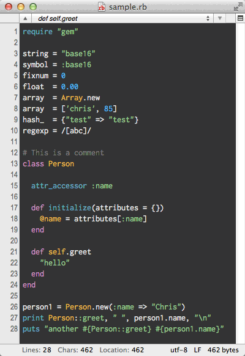

# CotEditorThemeConverter
=======================

Command line tool to convert theme files for [CotEditor 2](https://github.com/coteditor/CotEditor), the open-sourced light-weight text editor for Mac OS X.

## Converted themes example



You can also download converted themes from [CotEditor-themes](https://github.com/naotaka/CotEditor-themes).

## Installation

### Binary use

1. Download pre-compiled binary from [releases](./releases).
2. Unpack the downloaded archive.
3. Copy the unpacked `CotEditorThemeConverter` file to your search path.

### REPL use

Simply clone this repository.

## Usage

After conversion, you can see converted themes in newly created `Converted Themes` folder on your desktop.

### Binary use

```bash
$ CotEditorThemeConverter <xcode-theme>
```

### REPL use on Mac OS X 10.9

```bash
$ /Applications/Xcode6-Beta7.app/Contents/Developer/usr/bin/xcrun swift -sdk /Applications/Xcode6-Beta7.app/Contents/Developer/Platforms/MacOSX.platform/Developer/SDKs/MacOSX10.10.sdk -target x86_64-apple-macosx10.9 </path/to/CotEditorThemeConverter/main.swift> <xcode-theme>
```

## License

MIT license. See the LICENSE file for more info.
